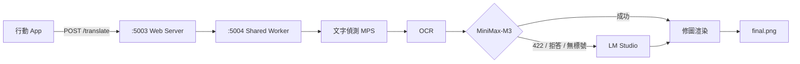

# Manga Image Translator — 本機自訂版說明

本文件說明此 fork 相對於上游 [zyddnys/manga-image-translator](https://github.com/zyddnys/manga-image-translator) 的**自訂改動**與**本機部署方式**。

上游倉庫：`origin` → `zyddnys/manga-image-translator`  
本 fork：`mine` → `singitsck/manga-image-translator`

---

## 功能概覽

| 項目 | 說明 |
|------|------|
| 主翻譯 | **MiniMax-M3**（OpenAI 相容 API） |
| 備援翻譯 | **LM Studio** 本機模型（遇內容審核 / 拒答時自動切換） |
| 目標語言 | 簡體中文（`CHS`） |
| 本機推論 | Apple Silicon **MPS**（偵測 / OCR / 修圖） |
| Python 環境 | **Miniforge** 專案內隔離（`.conda-env`） |
| 行動 App | 連線至 `http://<Mac IP>:5003`，翻譯器選 `chatgpt` |

### 翻譯流程



---

## 目錄結構（新增 / 修改）

```
manga-image-translator/
├── .env                          # 私密設定（勿 commit）
├── .conda-env/                   # Miniforge 環境（gitignore）
├── environment.yml               # conda-forge 環境定義
├── setup-miniforge.sh            # 一鍵建立 .conda-env
├── activate-miniforge.sh         # 啟用 .conda-env
├── requirements-mac.txt          # macOS pip 依賴（略過 bitsandbytes）
├── start.sh                      # 自動選 local / docker
├── start-lmstudio-local.sh       # 本機啟動（MPS）
├── start-docker.sh               # Docker 啟動
├── demo/doc/docker-compose-web-with-lmstudio.yml
├── manga_translator/
│   ├── translators/chatgpt.py    # MiniMax → LM Studio fallback
│   ├── detection/__init__.py     # Paddle 偵測器可選載入
│   └── mode/share.py             # pickle 白名單（Fraction）
└── server/
    ├── args.py                   # --context-size 參數
    ├── main.py                   # 轉發 context-size
    └── request_extraction.py     # SKIP_LANG 環境變數注入
```

---

## 環境需求

- **macOS**（Apple Silicon 建議）
- **Miniforge**（[下載](https://github.com/conda-forge/miniforge)）
- **LM Studio**（本機 fallback，預設 `http://127.0.0.1:1234`）
- **MiniMax API Key**
- （可選）Docker Desktop（Linux / 遷移用，Mac 上較慢）

---

## 快速開始

### 1. 克隆並進入專案

```bash
git clone https://github.com/singitsck/manga-image-translator.git
cd manga-image-translator
```

### 2. 建立 Miniforge 環境

```bash
# 安裝 Miniforge 後，確保 conda 在 PATH
source ~/miniforge3/etc/profile.d/conda.sh

./setup-miniforge.sh
```

會在專案內建立 `.conda-env/`，並安裝 PyTorch（MPS）與其餘依賴。首次執行約需數分鐘。

### 3. 設定 `.env`

在專案根目錄建立 `.env`（**不要提交到 Git**）：

```env
# 主翻譯：MiniMax M3
OPENAI_API_KEY=你的_MiniMax_Key
OPENAI_API_BASE=https://api.minimaxi.com/v1
OPENAI_MODEL=MiniMax-M3
OPENAI_GLOSSARY_PATH=./dict/mit_glossary.txt

# custom_openai 同步（App 若選此項也可用）
CUSTOM_OPENAI_API_KEY=你的_MiniMax_Key
CUSTOM_OPENAI_API_BASE=https://api.minimaxi.com/v1
CUSTOM_OPENAI_MODEL=MiniMax-M3

# App 無「跳過語言」選項時，伺服器強制略過已是中文的區塊
SKIP_LANG=CHS,CHT

# chatgpt 跨頁上下文（0=關閉，R18 內容建議 0~1 以加快本地 fallback）
CONTEXT_SIZE=5

# MiniMax 失敗時改打本機 LM Studio
OPENAI_FALLBACK_API_BASE=http://127.0.0.1:1234/v1
OPENAI_FALLBACK_API_KEY=lm-studio
OPENAI_FALLBACK_MODEL=qwen2.5-7b-instruct-uncensored
```

可複製 `examples/Example.env` 再依上表修改。

### 4. 設定 LM Studio

1. 下載並載入 `OPENAI_FALLBACK_MODEL` 對應模型（例如 `qwen2.5-7b-instruct-uncensored`）
2. 開啟 **Local Server**（預設埠 `1234`）
3. **停止字串建議**：刪除 `\n\n`，不要讓模型在空行處提早停止（會導致 `<|n|>` 標號不完整）
4. 溫度可設 `0.3` 左右

### 5. 啟動服務

```bash
./start.sh local
# 或
./start-lmstudio-local.sh
```

成功後會看到：

```
Translator API: https://api.minimaxi.com/v1 model=MiniMax-M3 context_size=5
INFO: Uvicorn running on http://0.0.0.0:5003
```

### 6. 行動 App 連線

- 伺服器地址：`http://<你的 Mac 區網 IP>:5003`
- 翻譯器：`chatgpt`
- 目標語言：簡體中文
- Nonce：留空或 `None`（本機已設 `--nonce None`）

---

## 啟動方式對照

| 指令 | 用途 |
|------|------|
| `./start.sh` | 自動：Mac → local，其他 → docker |
| `./start.sh local` | 本機 MPS + Miniforge |
| `./start.sh docker` | Docker（見下方） |
| `source ./activate-miniforge.sh` | 僅啟用 Python 環境 |

### Docker（可選）

適合遷移到 Linux / NVIDIA 主機；**Mac 上為 CPU 模擬，比本機 MPS 慢很多**。

```bash
./start-docker.sh
```

容器內會把 `OPENAI_FALLBACK_API_BASE` 覆寫為 `http://host.docker.internal:1234/v1`，以連回主機上的 LM Studio。

### GCP 雲端部署（GPU VM）

專案內含一鍵腳本 `deploy/gcp/deploy.sh`，會在 **Google Compute Engine** 建立帶 **NVIDIA T4** 的 Ubuntu VM，並以 Docker 啟動 API（埠 `5003`）。

**前置：**

1. 安裝並登入 [gcloud CLI](https://cloud.google.com/sdk/docs/install)
2. GCP 專案已啟用計費，且區域（如 `asia-east1-b`）有 GPU 配額
3. 專案根目錄已有 `.env`（可參考 `deploy/gcp/env.gcp.example`）

**部署：**

```bash
export GCP_PROJECT_ID=你的專案ID
export GCP_ZONE=asia-east1-b   # 依配額調整
./deploy/gcp/deploy.sh
```

**拆除：**

```bash
export GCP_PROJECT_ID=你的專案ID
./deploy/gcp/teardown.sh
```

GCP 上通常**沒有本機 LM Studio**；主翻譯仍走 MiniMax API，影像偵測／OCR／修圖在 VM GPU 上執行。若需 fallback，可在 `deploy/gcp/docker-compose-gcp-gpu.yml` 啟用 Ollama sidecar。

---

## 程式改動說明

### 1. `chatgpt.py` — 雲端 + 本機雙層翻譯

- 設定 `OPENAI_FALLBACK_API_BASE` 後，建立獨立的 LM Studio client
- **硬拒答**：MiniMax 回 `422 new_sensitive` 等內容審核錯誤 → 立刻切 fallback，不再空轉重試
- **軟拒答**：回 200 但無 `<|n|>` 標號（或明顯拒答文字）→ 立刻切 fallback
- Fallback 預設模型：`qwen2.5-7b-instruct-uncensored`

### 2. `request_extraction.py` — `SKIP_LANG`

App 未傳 `skip_lang` 時，由環境變數 `SKIP_LANG=CHS,CHT` 注入，避免重翻已是中文的區塊。

### 3. `server/args.py` / `main.py` — `--context-size`

支援從命令列與 `.env` 的 `CONTEXT_SIZE` 控制 chatgpt 跨頁上下文頁數。

### 4. `share.py` — Pickle 白名單

允許 `fractions.Fraction`，修復 App 傳入 `unclip_ratio: 2.3` 等設定時的序列化錯誤。

### 5. `detection/__init__.py` — 可選 Paddle 偵測

`rusty_manga_image_translator` 未安裝時不會導致整體啟動失敗。

---

## 常見問題

### App 顯示「要求逾時」

本機翻譯一頁可能需 1~3 分鐘（偵測 + OCR + LLM + 大圖 inpaint），App 預設逾時可能太短。

建議：

- 將 App 請求逾時調高（若可設定）
- R18 作品將 `CONTEXT_SIZE` 改為 `0` 或 `1`
- 確認 LM Studio 已刪除 stop string `\n\n`
- 一次少翻幾頁，等伺服器 log 出現完成再繼續

### `GET /json/version` 404

正常。此專案沒有該路由，多為探測請求，不影響翻譯。

### 埠 5003 被占用

```bash
pkill -f 'server/main.py --verbose --start-instance'
./start.sh local
```

### Fallback 標號數量不符（expected N got N-1）

多半是 LM Studio 的 `\n\n` 停止字串導致輸出被截斷，請刪除該設定。

### 實驗版 Python 警告

啟動時的 Rust rewrite 提示為上游專案訊息，可忽略。

---

## 遷移到新 Mac

**必帶：**

- 整個專案目錄（或 `git clone` + `git pull`）
- `.env`（需另外拷貝，不在 Git 內）

**建議帶：**

- `models/`（已下載的模型，可省時間）
- `dict/`（若有自訂術語表）

**不需帶：**

- `.conda-env/`、`venv/`（新機重跑 `./setup-miniforge.sh`）

**新機步驟：**

```bash
git clone https://github.com/singitsck/manga-image-translator.git
cd manga-image-translator
cp /舊機路徑/.env .
source ~/miniforge3/etc/profile.d/conda.sh
./setup-miniforge.sh
# LM Studio 載入 fallback 模型並開 Local Server
./start.sh local
```

---

## Git 遠端

```bash
git remote -v
# origin  → zyddnys/manga-image-translator（上游）
# mine    → singitsck/manga-image-translator（本 fork）

# 推送自訂改動
gh auth switch --user singitsck   # 若有多帳號
git push mine main
```

---

## 安全提醒

- **切勿**將 `.env` 或 API Key 提交到 Git
- 若 Key 曾外洩，請至 MiniMax 後台輪換

---

## 參考

- 上游專案：[zyddnys/manga-image-translator](https://github.com/zyddnys/manga-image-translator)
- 本 fork：[singitsck/manga-image-translator](https://github.com/singitsck/manga-image-translator)
- Miniforge：https://github.com/conda-forge/miniforge
- LM Studio：https://lmstudio.ai
